# REST API Plan

## API Architecture Diagram

```mermaid
graph TB
    Client[Client Application]
    
    subgraph Auth ["Supabase Authentication"]
        Signup["POST /auth/v1/signup"]
        Login["POST /auth/v1/token"]
        Logout["POST /auth/v1/logout"]
        Refresh["POST /auth/v1/token refresh"]
    end
    
    subgraph API ["Custom API Endpoints"]
        subgraph Collections ["Collections API"]
            CollList["GET /api/collections"]
            CollCreate["POST /api/collections"]
            CollGet["GET /api/collections/id"]
            CollUpdate["PUT /api/collections/id"]
            CollDelete["DELETE /api/collections/id"]
        end
        
        subgraph Categories ["Categories API"]
            CatList["GET /api/categories"]
            CatCreate["POST /api/categories"]
            CatUpdate["PUT /api/categories/id"]
            CatDelete["DELETE /api/categories/id"]
        end
        
        subgraph Flashcards ["Flashcards API"]
            FCList["GET /api/flashcards"]
            FCCreate["POST /api/flashcards"]
            FCBulk["POST /api/flashcards/bulk"]
            FCGet["GET /api/flashcards/id"]
            FCUpdate["PUT /api/flashcards/id"]
            FCDelete["DELETE /api/flashcards/id"]
        end
        
        subgraph AI ["AI Generation API"]
            AIGen["POST /api/generate/flashcards"]
            AIAccept["POST /api/generate/flashcards/id/accept"]
        end
        
        subgraph Stats ["Statistics API"]
            StatsGen["GET /api/stats/generation"]
            StatsGenUpdate["PUT /api/stats/generation"]
            StatsLearn["GET /api/stats/learning"]
        end
        
        subgraph Study ["Study Session API"]
            StudyNext["GET /api/study/next"]
            StudyReview["POST /api/study/sessions/id/review"]
        end
    end
    
    subgraph DB ["Supabase Database"]
        PostgreSQL[(PostgreSQL + RLS)]
        Users[users table]
        CollTable[collections table]
        CatTable[categories table]
        FCTable[flashcards table]
        GenStats[generation_stats table]
    end
    
    subgraph External ["External Services"]
        OpenRouter[OpenRouter.ai]
    end
    
    %% Authentication Flow
    Client --> Auth
    Client --> Signup
    Client --> Login
    Client --> Logout
    Client --> Refresh
    
    %% API Access with JWT
    Client -.->|JWT Token| Collections
    Client -.->|JWT Token| Categories
    Client -.->|JWT Token| Flashcards
    Client -.->|JWT Token| AI
    Client -.->|JWT Token| Stats
    Client -.->|JWT Token| Study
    
    %% Data Flow
    CollCreate --> CollTable
    CatCreate --> CatTable
    FCCreate --> FCTable
    FCBulk --> FCTable
    
    %% AI Generation Flow
    AIGen --> OpenRouter
    OpenRouter --> AIGen
    AIAccept --> FCTable
    AIAccept --> GenStats
    
    %% Study Flow
    StudyNext --> FCTable
    StudyReview --> FCTable
    StudyReview --> GenStats
    
    %% Database Relations
    Users --> CollTable
    Users --> CatTable
    Users --> FCTable
    Users --> GenStats
    CollTable --> FCTable
    CatTable --> FCTable
    
    %% RLS Security
    PostgreSQL -.->|auth.uid| Users
    PostgreSQL -.->|auth.uid| CollTable
    PostgreSQL -.->|auth.uid| CatTable
    PostgreSQL -.->|auth.uid| FCTable
    PostgreSQL -.->|auth.uid| GenStats
    
    classDef authEndpoint fill:#e1f5fe
    classDef apiEndpoint fill:#f3e5f5
    classDef aiEndpoint fill:#e8f5e8
    classDef dbTable fill:#fff3e0
    classDef external fill:#ffebee
    
    class Signup,Login,Logout,Refresh authEndpoint
    class CollList,CollCreate,CatList,CatCreate,FCList,FCCreate apiEndpoint
    class AIGen,AIAccept aiEndpoint
    class Users,CollTable,CatTable,FCTable,GenStats dbTable
    class OpenRouter external
```



## 1. Resources

The API is organized around the following main resources mapped to database entities:

- **Collections** - `collections` table - Groups of flashcards for organization
- **Categories** - `categories` table - Classification system for flashcards  
- **Flashcards** - `flashcards` table - Individual flashcard entities with front/back content
- **Generation Stats** - `flashcard_generation_stats` table - AI generation statistics tracking
- **Users** - `users` table - **Fully managed by Supabase Auth** (no custom user endpoints needed)

**Note**: All custom API endpoints automatically inherit user context from Supabase JWT tokens. No manual user management is required.

## 2. Endpoints

### Supabase Authentication Endpoints

**Important**: All authentication is handled by Supabase Auth. No custom authentication endpoints are implemented. The application uses Supabase's built-in authentication system.

#### POST /auth/v1/signup
- **Description**: Register a new user account (Supabase managed)
- **Base URL**: `https://jbxaoqwdncomzukzeiiq.supabase.co`
- **Request Body**: 
```json
{
  "email": "user@example.com",
  "password": "password123"
}
```
- **Success Response**: `200 OK`
```json
{
  "access_token": "jwt_token",
  "refresh_token": "refresh_token",
  "user": {
    "id": "uuid",
    "email": "user@example.com",
    "email_confirmed_at": null
  }
}
```
- **Error Responses**: 
  - `400 Bad Request` - Invalid email or password format
  - `422 Unprocessable Entity` - Email already exists

#### POST /auth/v1/token?grant_type=password
- **Description**: Sign in user (Supabase managed)
- **Base URL**: `https://jbxaoqwdncomzukzeiiq.supabase.co`
- **Request Body**:
```json
{
  "email": "user@example.com", 
  "password": "password123"
}
```
- **Success Response**: `200 OK`
```json
{
  "access_token": "jwt_token",
  "refresh_token": "refresh_token",
  "user": {
    "id": "uuid",
    "email": "user@example.com"
  }
}
```
- **Error Responses**:
  - `400 Bad Request` - Invalid credentials
  - `401 Unauthorized` - Authentication failed

#### POST /auth/v1/logout
- **Description**: Sign out user (Supabase managed)
- **Headers**: `Authorization: Bearer <jwt_token>`
- **Success Response**: `204 No Content`

#### POST /auth/v1/token?grant_type=refresh_token
- **Description**: Refresh access token (Supabase managed)
- **Request Body**:
```json
{
  "refresh_token": "refresh_token"
}
```

### Collections API

**All Collections endpoints require Supabase authentication and automatically filter by authenticated user.**

#### GET /api/collections
- **Description**: Get all collections for authenticated user
- **Authentication**: Requires Supabase JWT token
- **Query Parameters**:
  - `limit` (optional): Number of results (default: 50, max: 100)
  - `offset` (optional): Pagination offset (default: 0)
  - `sort` (optional): Sort order - "name", "created_at" (default: "created_at")
  - `order` (optional): "asc" or "desc" (default: "desc")
- **Success Response**: `200 OK`
```json
{
  "data": [
    {
      "id": "uuid",
      "name": "Spanish Vocabulary",
      "description": "Basic Spanish words",
      "flashcard_count": 25
    }
  ],
  "pagination": {
    "total": 1,
    "limit": 50,
    "offset": 0
  }
}
```

#### POST /api/collections
- **Description**: Create a new collection
- **Request Body**:
```json
{
  "name": "French Grammar",
  "description": "French grammar rules and examples"
}
```
- **Success Response**: `201 Created`
```json
{
  "id": "uuid",
  "name": "French Grammar", 
  "description": "French grammar rules and examples",
  "flashcard_count": 0
}
```
- **Error Responses**:
  - `400 Bad Request` - Name exceeds 100 characters or description exceeds 500 characters
  - `401 Unauthorized` - Not authenticated

#### GET /api/collections/{id}
- **Description**: Get specific collection details
- **Success Response**: `200 OK`
```json
{
  "id": "uuid",
  "name": "Spanish Vocabulary",
  "description": "Basic Spanish words",
  "flashcard_count": 25,
  "created_at": "2024-01-01T00:00:00Z"
}
```
- **Error Responses**:
  - `404 Not Found` - Collection not found or not owned by user

#### PUT /api/collections/{id}
- **Description**: Update collection details
- **Request Body**:
```json
{
  "name": "Updated Collection Name",
  "description": "Updated description"
}
```
- **Success Response**: `200 OK`
- **Error Responses**:
  - `400 Bad Request` - Validation failed
  - `404 Not Found` - Collection not found

#### DELETE /api/collections/{id}
- **Description**: Delete collection (sets flashcards collection_id to NULL)
- **Success Response**: `204 No Content`
- **Error Responses**:
  - `404 Not Found` - Collection not found

### Categories API

**All Categories endpoints require Supabase authentication and automatically filter by authenticated user.**

#### GET /api/categories
- **Description**: Get all categories for authenticated user
- **Query Parameters**: Same pagination as collections
- **Success Response**: `200 OK`
```json
{
  "data": [
    {
      "id": "uuid",
      "name": "Verbs",
      "description": "Action words",
      "flashcard_count": 15
    }
  ]
}
```

#### POST /api/categories
- **Description**: Create a new category
- **Request Body**:
```json
{
  "name": "Adjectives",
  "description": "Descriptive words"
}
```
- **Success Response**: `201 Created`
- **Error Responses**:
  - `400 Bad Request` - Name exceeds 50 characters, description exceeds 200 characters, or name already exists
  - `409 Conflict` - Category name already exists for user

#### PUT /api/categories/{id}
#### DELETE /api/categories/{id}
- Similar patterns to collections endpoints

### Flashcards API

**All Flashcards endpoints require Supabase authentication and automatically filter by authenticated user.**

#### GET /api/flashcards
- **Description**: Get flashcards for authenticated user
- **Query Parameters**:
  - `collection_id` (optional): Filter by collection
  - `category_id` (optional): Filter by category
  - `limit`, `offset`, `sort`, `order`: Standard pagination
- **Success Response**: `200 OK`
```json
{
  "data": [
    {
      "id": "uuid",
      "front": "Hello",
      "back": "Hola", 
      "collection_id": "uuid",
      "category_id": "uuid",
      "created_at": "2024-01-01T00:00:00Z",
      "updated_at": "2024-01-01T00:00:00Z"
    }
  ]
}
```

#### POST /api/flashcards
- **Description**: Create a single flashcard manually
- **Request Body**:
```json
{
  "front": "Good morning",
  "back": "Buenos días",
  "collection_id": "uuid",
  "category_id": "uuid"
}
```
- **Success Response**: `201 Created`
- **Error Responses**:
  - `400 Bad Request` - Front exceeds 200 chars or back exceeds 500 chars
  - `404 Not Found` - Collection or category not found

#### POST /api/flashcards/bulk
- **Description**: Create multiple flashcards (used for AI-generated and bulk operations)
- **Request Body**:
```json
{
  "flashcards": [
    {
      "front": "Hello",
      "back": "Hola",
      "collection_id": "uuid",
      "category_id": "uuid"
    }
  ]
}
```
- **Success Response**: `201 Created`
```json
{
  "created": 5,
  "flashcards": [...]
}
```

#### GET /api/flashcards/{id}
#### PUT /api/flashcards/{id} 
#### DELETE /api/flashcards/{id}
- Standard CRUD operations with same validation rules

### AI Generation API

**All AI Generation endpoints require Supabase authentication and automatically associate generated content with authenticated user.**

#### POST /api/generate/flashcards
- **Description**: Generate flashcards from text using AI
- **Request Body**:
```json
{
  "text": "Input text for generation (1000-10000 characters)",
  "collection_id": "uuid",
  "category_id": "uuid"
}
```
- **Success Response**: `200 OK`
```json
{
  "candidates": [
    {
      "front": "Generated front text",
      "back": "Generated back text"
    }
  ],
  "generation_id": "uuid"
}
```
- **Error Responses**:
  - `400 Bad Request` - Text length not between 1000-10000 characters
  - `422 Unprocessable Entity` - AI generation failed
  - `429 Too Many Requests` - Rate limit exceeded

#### POST /api/generate/flashcards/{generation_id}/accept
- **Description**: Accept AI-generated flashcards (supports bulk acceptance)
- **Request Body**:
```json
{
  "accepted_cards": [
    {
      "front": "Hello",
      "back": "Hola",
      "edited": false
    },
    {
      "front": "Good morning", 
      "back": "Buenos días",
      "edited": true
    }
  ],
  "collection_id": "uuid",
  "category_id": "uuid"
}
```
- **Success Response**: `201 Created`
```json
{
  "created": 2,
  "flashcards": [...]
}
```

### Statistics API

**All Statistics endpoints require Supabase authentication and automatically filter by authenticated user.**

#### GET /api/stats/generation
- **Description**: Get AI generation statistics for user
- **Success Response**: `200 OK`
```json
{
  "total_generated": 150,
  "total_accepted_direct": 100,
  "total_accepted_edited": 25,
  "acceptance_rate": 0.83,
  "edit_rate": 0.17
}
```

#### PUT /api/stats/generation
- **Description**: Update generation statistics (internal use)
- **Request Body**:
```json
{
  "total_generated": 5,
  "total_accepted_direct": 3,
  "total_accepted_edited": 1
}
```

#### GET /api/stats/learning
- **Description**: Get learning progress statistics
- **Query Parameters**:
  - `collection_id` (optional): Filter by collection
  - `period` (optional): "week", "month", "year", "all" (default: "month")
- **Success Response**: `200 OK`
```json
{
  "total_flashcards": 100,
  "total_reviews": 250,
  "accuracy_rate": 0.85,
  "average_session_time": 120
}
```

### Study Session API

**All Study Session endpoints require Supabase authentication and automatically filter by authenticated user.**

#### GET /api/study/next
- **Description**: Get next flashcards for study session using spaced repetition
- **Query Parameters**:
  - `collection_id` (optional): Study specific collection
  - `limit` (optional): Number of cards (default: 10, max: 50)
- **Success Response**: `200 OK`
```json
{
  "flashcards": [
    {
      "id": "uuid",
      "front": "Hello",
      "back": "Hola",
      "due_date": "2024-01-01T00:00:00Z"
    }
  ],
  "session_id": "uuid"
}
```

#### POST /api/study/sessions/{session_id}/review
- **Description**: Submit review results for flashcards
- **Request Body**:
```json
{
  "reviews": [
    {
      "flashcard_id": "uuid",
      "result": "correct|incorrect|partial",
      "response_time": 5.2
    }
  ]
}
```
- **Success Response**: `200 OK`
```json
{
  "processed": 1,
  "next_review_dates": {
    "uuid": "2024-01-03T00:00:00Z" 
  }
}
```

## 3. Authentication and Authorization

### Supabase Authentication Integration
- **Supabase Auth**: Complete authentication system managed by Supabase
- **JWT Tokens**: All custom API endpoints require Supabase-issued JWT tokens
- **Header Format**: `Authorization: Bearer <supabase_jwt_token>`
- **Token Validation**: Automatically validated using Supabase client libraries
- **User Context**: User ID extracted from JWT using `auth.uid()` in database queries
- **No Custom Auth**: Zero custom authentication logic - fully delegated to Supabase

### Supabase Row Level Security (RLS)
- **Automatic User Isolation**: All database tables use RLS policies with `auth.uid()`
- **Policy Examples**:
  ```sql
  -- Users can only see their own flashcards
  CREATE POLICY "Users can view their own flashcards" ON flashcards
    FOR SELECT USING (auth.uid() = user_id);
  
  -- Users can only create flashcards for themselves  
  CREATE POLICY "Users can insert their own flashcards" ON flashcards
    FOR INSERT WITH CHECK (auth.uid() = user_id);
  ```
- **Resource Ownership**: RLS ensures users can only access their own data
- **No Manual Authorization**: Database-level security eliminates manual permission checks

### Supabase Security Features
- **Email Verification**: Optional email confirmation on signup
- **Password Reset**: Built-in password reset flow via email
- **Session Management**: Automatic token refresh and session handling
- **Rate Limiting**: Supabase-level rate limiting for auth endpoints
- **GDPR Compliance**: Built-in user deletion with cascade to related data

### API Security
- **CORS**: Configured through Supabase dashboard
- **Rate Limiting**: Custom rate limiting for AI generation (10 requests/minute)
- **Request Limits**: 10MB for text input, 1MB for other requests
- **Environment Variables**: Supabase credentials via `SUPABASE_URL` and `SUPABASE_ANON_KEY`

## 4. Validation and Business Logic

### Field Validation
- **Flashcard Front**: Required, max 200 characters
- **Flashcard Back**: Required, max 500 characters  
- **Collection Name**: Required, max 100 characters
- **Collection Description**: Optional, max 500 characters
- **Category Name**: Required, max 50 characters, unique per user
- **Category Description**: Optional, max 200 characters
- **AI Generation Text**: Required, 1000-10000 characters

### Business Logic Rules

#### AI Generation Process
1. Validate input text length (1000-10000 chars)
2. Send to OpenRouter.ai for processing
3. Generate 5-15 flashcard candidates
4. Store generation statistics
5. Return candidates for user review
6. On acceptance, create flashcards and update stats

#### Statistics Tracking
- Increment `total_generated` when AI creates candidates
- Increment `total_accepted_direct` for unedited acceptances
- Increment `total_accepted_edited` for edited acceptances
- Maintain constraint: accepted_total ≤ total_generated

#### Spaced Repetition Integration
- Calculate next review dates based on performance
- Track response times and accuracy
- Adjust intervals using SM-2 algorithm (external library)
- Update due dates after each review session

#### Data Retention (GDPR Compliance)
- User deletion removes all flashcards, collections, categories, and stats
- Soft delete for audit trails where required
- Export functionality for data portability
- Anonymization of statistical data after user deletion

### Error Handling
- Consistent error response format across all endpoints
- Detailed validation messages for client-side display  
- Proper HTTP status codes for different error types
- Logging of all errors for monitoring and debugging 