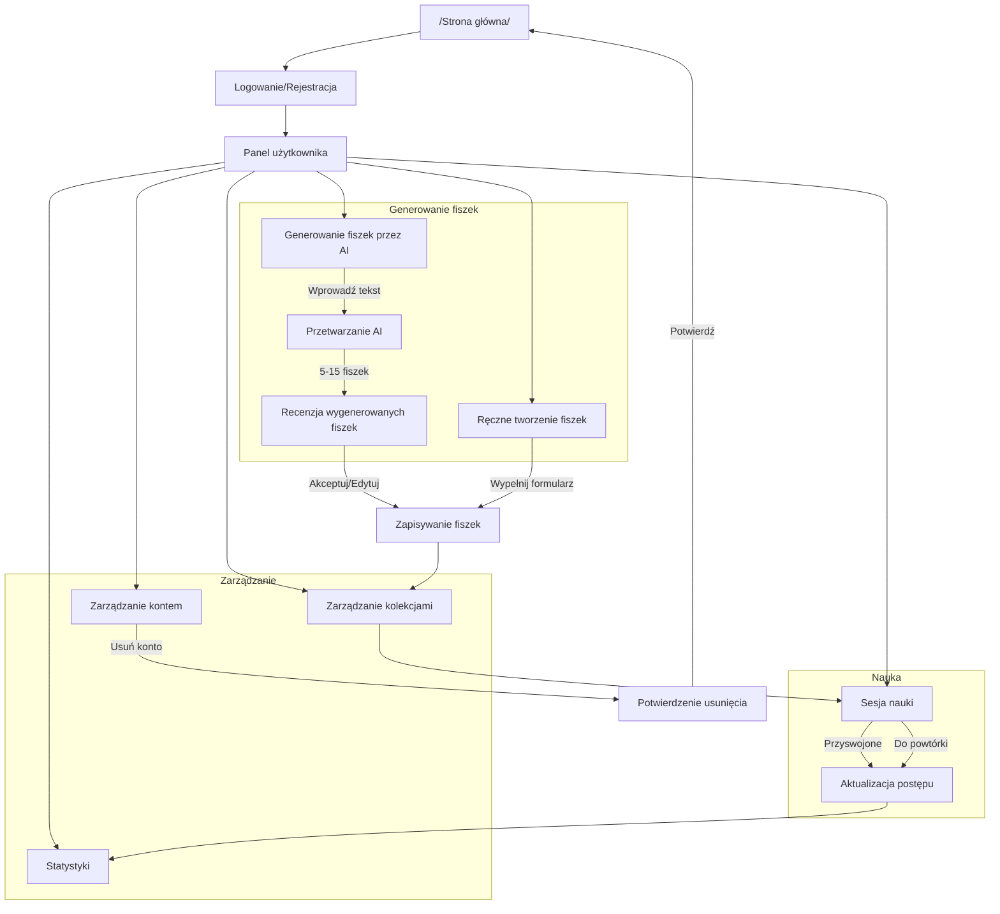

# Diagram przepływu funkcjonalności aplikacji Fiszki

## Diagram

## Opis przepływu

### 1. Rozpoczęcie pracy
- Użytkownik rozpoczyna od strony głównej
- Wymagane jest zalogowanie się lub rejestracja przez Supabase
- Po zalogowaniu użytkownik trafia do panelu użytkownika

### 2. Generowanie fiszek
#### Ścieżka AI
1. Użytkownik wybiera opcję generowania przez AI
2. Wprowadza tekst (1000-10000 znaków)
3. AI generuje 5-15 propozycji fiszek
4. Użytkownik recenzuje każdą fiszkę:
   - Akceptuje bez zmian
   - Edytuje i akceptuje
   - Odrzuca

#### Ścieżka manualna
1. Użytkownik wybiera ręczne tworzenie
2. Wypełnia formularz (Front ≤200 znaków, Back ≤500 znaków)
3. Fiszka jest zapisywana w kolekcji

### 3. Nauka
1. Użytkownik wybiera kolekcję do nauki
2. System prezentuje fiszki według algorytmu powtórek
3. Dla każdej fiszki użytkownik oznacza:
   - "Przyswojone" - zwiększa interwał powtórki
   - "Wymaga powtórki" - resetuje interwał
4. System aktualizuje statystyki nauki

### 4. Zarządzanie
#### Kolekcje
- Organizacja fiszek w zestawy
- Możliwość edycji i usuwania fiszek
- Przeglądanie postępów per kolekcja

#### Statystyki
- Śledzenie skuteczności generowania AI
- Monitorowanie czasu nauki
- Analiza postępów

#### Konto
- Zarządzanie danymi użytkownika
- Możliwość usunięcia konta z potwierdzeniem
- Zgodność z RODO

## Metryki sukcesu
1. **Generowanie AI**
   - 75% wygenerowanych fiszek jest akceptowanych
   - 75% wszystkich fiszek pochodzi z AI

2. **Efektywność nauki**
   - Średni czas przeglądu < 2 minuty na sesję 