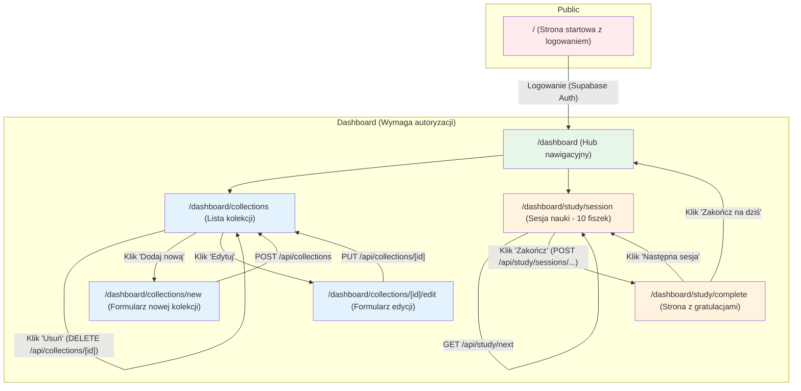

<conversation_summary>
<decisions>

1.  **Główny Layout:** Rezygnacja z dedykowanego, wspólnego layoutu nawigacyjnego na rzecz prostoty. Centralnym punktem nawigacyjnym jest strona główna panelu (`/dashboard`), która działa jak hub z linkami.
2.  **Zarządzanie zasobami (CRUD):** Wszystkie operacje (tworzenie, edycja) będą realizowane na dedykowanych podstronach (np. `/collections/new`), a nie w modalach. Usunięcie elementu z listy powoduje przeładowanie strony.
3.  **Recenzja fiszek AI:** Edycja fiszki podczas recenzji przekierowuje na osobną, prostą podstronę formularza. Zmiany dla całej listy są zapisywane jednym przyciskiem "Zapisz" na końcu, który wysyła dane i przekierowuje użytkownika.
4.  **Sesja nauki:** Jedna sesja to 10 fiszek wyświetlonych na jednej stronie. Użytkownik zaznacza wszystkie odpowiedzi, klika "Zakończ", co wysyła wyniki i przekierowuje na stronę z gratulacjami.
5.  **Strona z gratulacjami:** Po zakończeniu sesji nauki strona z gratulacjami będzie zawierać dwie opcje: "Następna sesja" (przekierowanie do nowej sesji) oraz "Zakończ na dziś" (przekierowanie do panelu głównego).
6.  **Komponent `AuthButton`:** Wykorzystanie istniejącego komponentu `src/components/auth/AuthButton.tsx` do obsługi wylogowywania.
7.  **Puste stany:** Widoki dla pustych list (np. brak kolekcji) będą proste, renderowane po stronie serwera w plikach `.astro` i będą zawierały statyczny tekst oraz link do akcji (np. "Stwórz pierwszą kolekcję").
8.  **Formularze:** Wszystkie formularze będą prostymi stronami renderowanymi serwerowo, które po przesłaniu wykonują pełne przeładowanie strony.
    </decisions>
    <matched_recommendations>
9.  **Struktura plików:** Zalecana struktura podstron w `src/pages/dashboard/` (np. `/collections/index.astro`, `/collections/new.astro`, `/categories/index.astro`) jest zgodna z podjętymi decyzjami.
10. **Minimalna interaktywność (Astro Islands):** Decyzje o renderowaniu serwerowym i minimalnym JS po stronie klienta idealnie pasują do rekomendacji tworzenia małych, izolowanych "wysp" React (`client:load`) tylko dla absolutnie niezbędnych funkcjonalności (jak `AuthButton`).
11. **Przekazywanie danych do komponentów:** Strategia pobierania danych w części `---` plików `.astro` i przekazywania ich jako `props` do komponentów jest kluczowa dla przyjętego, prostego modelu.
12. **Proste statystyki:** Decyzja o użyciu zwykłych cyfr i kolorów będzie zaimplementowana przy użyciu komponentów `Card` z biblioteki Shadcn/ui, co jest zgodne z rekomendacją.
13. **Wykorzystanie istniejącej struktury:** Potwierdzono, że nie ma potrzeby pisania niczego od zera, a nowe funkcjonalności będą rozbudową istniejącego kodu w `src`, co było kluczową rekomendacją.
    </matched_recommendations>
    <ui_architecture_planning_summary>
    Na podstawie serii pytań i odpowiedzi, architektura interfejsu użytkownika (UI) dla MVP aplikacji Fiszki została jasno zdefiniowana. Priorytetem jest maksymalna prostota implementacji i testowania, w pełnej zgodzie z filozofią frameworka Astro.

**a. Główne wymagania dotyczące architektury UI:**
Architektura opiera się na renderowaniu po stronie serwera (SSR) z wykorzystaniem plików `.astro`. Interaktywność po stronie klienta jest ograniczona do absolutnego minimum i realizowana za pomocą izolowanych komponentów React (Astro Islands). Rezygnujemy ze złożonego, globalnego zarządzania stanem na rzecz tradycyjnych formularzy i pełnego przeładowania strony po akcjach.

**b. Kluczowe widoki, ekrany i przepływy użytkownika:**

- **Logowanie/Rejestracja:** Obsługiwane przez istniejące komponenty w `src/components/auth`.
- **Panel Główny (`/dashboard/index.astro`):** Działa jako hub nawigacyjny, bazując na istniejącym `Welcome.astro`.
- **Zarządzanie zasobami (Kolekcje, Kategorie):** Każdy zasób będzie miał dedykowane podstrony dla listy, tworzenia i edycji (np. `/dashboard/collections/`, `.../new`, `.../[id]/edit`).
- **Sesja Nauki (`/dashboard/study/session.astro`):** Wyświetla 10 fiszek na jednej stronie. Po zakończeniu następuje przekierowanie na stronę z gratulacjami, która daje wybór kontynuacji lub powrotu do panelu.
- **Recenzja AI:** Lista fiszek w jednym formularzu, z edycją realizowaną przez przekierowanie na osobną podstronę.

**c. Strategia integracji z API i zarządzania stanem:**

- **Pobieranie danych:** Dane są pobierane po stronie serwera w logice frontmatter (`---`) plików `.astro` i przekazywane jako właściwości (`props`) do renderowanych komponentów.
- **Wysyłanie danych:** Realizowane przez standardowe formularze HTML (`<form>`), które po przesłaniu (submit) wysyłają żądanie `POST` do endpointów API i powodują pełne przeładowanie strony.
- **Zarządzanie stanem:** Brak globalnej biblioteki do zarządzania stanem (jak Redux czy TanStack Query). Stan jest zarządzany lokalnie wewnątrz nielicznych komponentów React lub w ogóle (opierając się na przeładowaniu strony).

**d. Kwestie dotyczące responsywności, dostępności i bezpieczeństwa:**

- **Responsywność i dostępność:** Mają być realizowane w najprostszy możliwy sposób, z wykorzystaniem możliwości Tailwind CSS i domyślnie dostępnych komponentów Shadcn/ui.
- **Bezpieczeństwo:** Ochrona tras jest realizowana przez middleware Astro, które weryfikuje tokeny JWT Supabase. Istniejące, działające rozwiązanie autentykacji jest w pełni wykorzystywane.

</ui_architecture_planning_summary>
<unresolved_issues>
Brak. Faza planowania architektury UI dla MVP została zakończona. Wszystkie kluczowe decyzje zostały podjęte, a plan implementacji jest gotowy do realizacji.
</unresolved_issues>
</conversation_summary>
